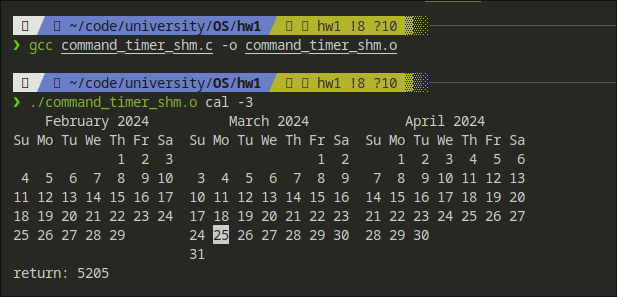
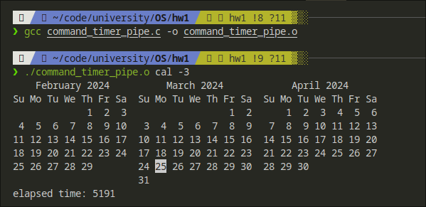
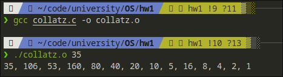
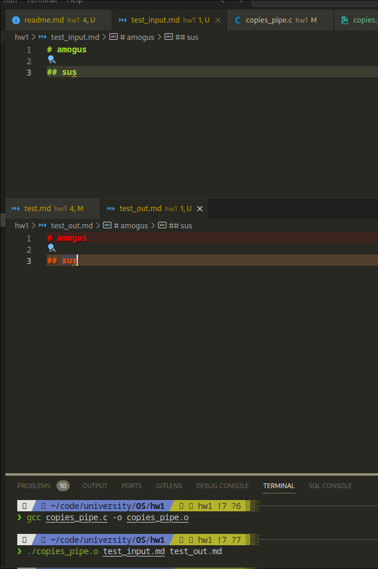

# hw1

## Programming Problems

### 2.24 copies contents

#### build

`gcc copies.c -o copies.o`

#### run

`./copies.o file1 file2`

#### screenshot

### 3.19 timer

#### v1 share memory
##### build
`gcc command_timer_shm.c -o command_timer_shm.o`
##### run
`./command_timer_shm.o command`
##### screenshot

#### v2 pipe
##### build
`gcc command_timer_pipe.c -o command_timer_pipe.o`
##### run
`./command_timer_pipe.o command`
##### screenshot

### 3.21 Collatz
#### build
`gcc collatz.c -o collatz.o`
#### run
`./collatz.o 35`
#### screenshot

### 3.27 file copying by pipes

#### build

`gcc copies_pipe.c -o copies_pipe.o`

#### run

`./copies_pipe.o file1 file2`

#### screenshot

