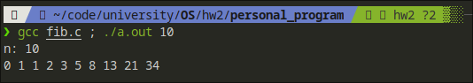
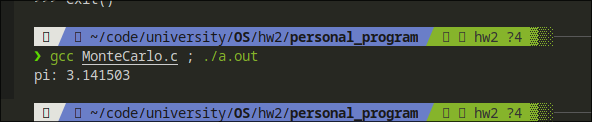

# hw2 personal program

110590002 王熯竑

## 4.27 Fibonacci sequence

### run

```bash
gcc fib.c ; ./a.out {number}
```

> example: `gcc fib.c ; ./a.out 10`
> screenshot:


## 4.24 Monte Carlo


### run

```bash
gcc MonteCarlo.c ; ./a.out
```
> screenshot:


## 6.33
 Assume that a finite number of resources of a single
resource type must be managed

### run 
```bash
gcc license.c ; ./a.out
```
