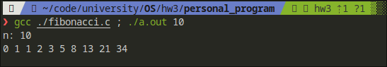
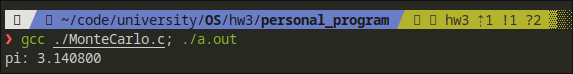
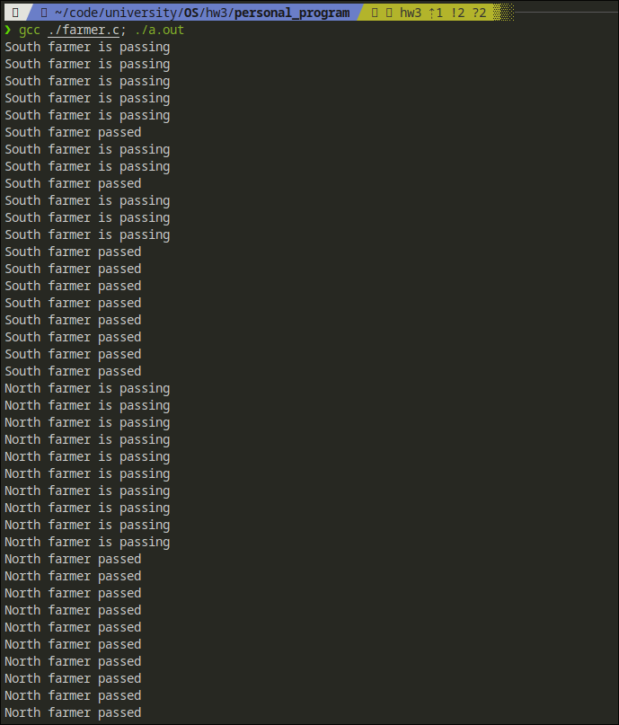
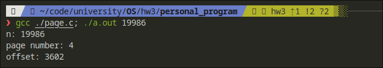

# hw3
## 7.15
> run
```bash
gcc ./fibonacci.c ; ./a.out 10
```



## 7.17
> run
```bash
gcc ./MonteCarlo.c ; ./a.out 
```



## 8.32
> run 
```bash
gcc ./farmer.c; ./a.out
```


## 9.28
> run 
```bash
gcc ./page.c; ./a.out 19986
```


