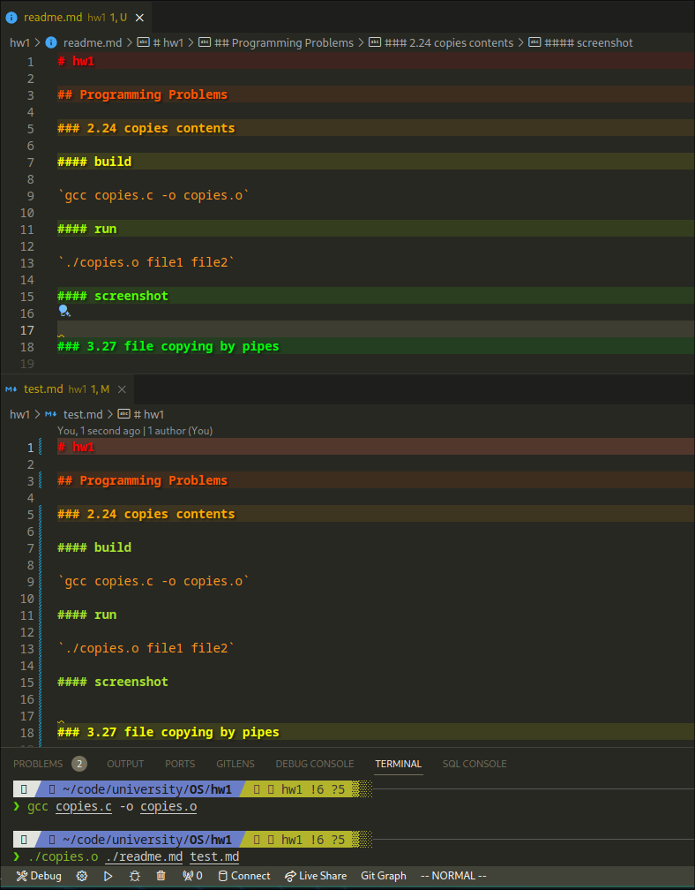

# hw1

## Programming Problems

### 2.24 copies contents

#### build

`gcc copies.c -o copies.o`

#### run

`./copies.o file1 file2`

#### screenshot

### 3.27 file copying by pipes

#### build

`gcc copies_pipe.c -o copies_pipe.o`

#### run

`./copies_pipe.o file1 file2`

#### screenshot

